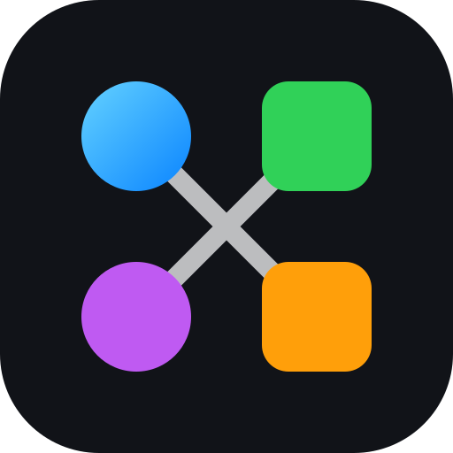

# matter.swift

<p align="center"></p>

[](https://github.com/ezefranca/matter.swift/actions/workflows/tests.yml)
[](https://ezefranca.com/matter.swift/documentation/matter/)
[](https://swiftpackageindex.com/ezefranca/matter.swift)
[](Scripts/check_coverage.py)


[](LICENSE)

matter.swift is a deterministic, Metal-first native Swift physics engine inspired conceptually by [Matter.js](https://brm.io/matter-js/). It has no SpriteKit dependency, no JavaScript runtime, and no dependency on p5.swift.

The package is a pre-1.0 release candidate. Its public API, DocC inventory, 100% production line/region coverage gates, and macOS/iOS build matrix are enforced in CI.

## Add the package

```swift
dependencies: [
    .package(url: "https://github.com/ezefranca/matter.swift", branch: "main")
]
```

Add the `Matter` product to your target and `import Matter`.

## Step a world

```swift
import Matter

let engine = try Engine(gravity: Vector(x: 0, y: 9.81))
let ball = try await engine.add(
    Bodies.circle(at: Vector(x: 0, y: -10), radius: 1, mass: 1)
)
try await engine.applyForce(Vector(x: 2, y: 0), to: ball)
let world = try await engine.step()
let body = world.body(withID: ball)
```

`Engine` owns Metal execution and never silently falls back. `ReferenceIntegrator` is an explicit deterministic CPU oracle for tests and conformance. See [Getting Started](Sources/Matter/Matter.docc/GettingStarted.md) and the [complete DocC site](https://ezefranca.com/matter.swift/documentation/matter/).

## Physics surface

- Validated circles, rectangles, polygons, trapezoids, compound and concave bodies.
- Sweep-and-prune broad phase, SAT narrow phase, persistent contacts, warm starting, friction, restitution, sensors, and collision filtering.
- Distance constraints, springs, chains, cloth, bridges, rotational locks, motors, attraction, sleeping, islands, and bounded CCD.
- Stable composites, transactional world mutation, point/region/raycast queries, ordered events, fixed-step runners, and immutable snapshots.
- Metal integration with typed device, shader, allocation, encoding, execution, and cancellation failures.

The [Matter.js compatibility guide](Sources/Matter/Matter.docc/MatterCompatibility.md) records native naming, actor, determinism, rendering, and browser differences.

## Run and validate

```sh
swift run MatterSmokeSample
DEVELOPER_DIR=/Applications/Xcode.app/Contents/Developer bash Scripts/validate.sh
```

The repository owns its SwiftPM manifest, test plan, API baseline, DocC deployment, SPI configuration, security policy, performance budgets, and semantic-release workflow. See [Contributing](CONTRIBUTING.md) and [Releasing](Documentation/Releasing.md).

## Package family

- [p5.swift](https://github.com/ezefranca/p5.swift) — native creative coding inspired by p5.js.
- [ml5.swift](https://github.com/ezefranca/ml5.swift) — approachable Core ML and native dense training inspired by ml5.js.

The repositories are independently versioned and may be composed only at the application layer.

## Scope and attribution

Matter.js informs conceptual vocabulary; its source is not distributed here. Daniel Shiffman's [The Nature of Code](https://natureofcode.com/) informed reusable physics requirements, while exhaustive book example ports remain out of scope. See [third-party notices](THIRD_PARTY_NOTICES.md).
